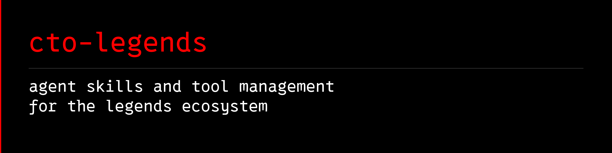

<a name="cto-legends"></a>

# 

**An open-source agent skills and tool manager for the Legends ecosystem.**

[](https://github.com/avalonreset/cto-legends/actions/workflows/checks.yml)
[](https://github.com/avalonreset/cto-legends/releases)
[](LICENSE)

Tell your agent what you want to do. `cto-legends` helps it find the right module,
install a verified version, and maintain the components you actually use.
Each module remains its own open-source project. Register one central skill, then
load specialized instructions only when a task needs them.

This is a curated Legends module manager, not a directory of every third-party
skill. It manages verified releases and separate tool environments, while your
agent supplies the reasoning. [How agent skills and modules fit together](docs/AGENT-SKILLS.md).

The central recipe targets **Grok, Codex, Gemini, Claude, Cursor, and MetaMuse**.
Use the documented host registration or explicitly load the portable skill.
Host discovery and operational verification are tracked separately.

## Start here

Python 3.10 or newer is required for the manager; use Python 3.11+ to include Obsidian. No Git, provider account, background service,
or MCP server is needed to install the ecosystem manager.

From a source checkout, install with `python -m pip install .`. The release
wheel command below installs the v0.5.0 release.

```sh
python -m pip install "https://github.com/avalonreset/cto-legends/releases/download/v0.5.0/cto_legends-0.5.0-py3-none-any.whl"
cto-legends route "Google Maps ranking grids"
cto-legends install legends-geogrid
cto-legends install legends-geogrid --apply
cto-legends doctor
```

If your scripts directory is not on PATH, use `python -m cto_legends` instead
of `cto-legends`. Installation previews are offline. `--apply` downloads source
and Python dependencies; it never runs paid research.

## Install agent skills for your chosen host

Copy the included routing skill into **your chosen agent's skill directory**:

```sh
cto-legends install-skill --directory ~/.agents/skills --apply
```

Use the directory your agent actually reads (for example a configured Codex
skills directory or `~/.claude/skills`). This is an explicit choice: the installer
does not scan or rewrite every agent configuration. Existing skills are never
overwritten. Reload your agent's skills, then ask:

> Can we generate some AI music?

The central skill selects the audio workflow and reads its installed recipe.
It checks model access and hardware before promising generation. No separate
Stable Audio skill registration is needed. Try "study my business on Google Maps"
or "save this research in my vault" for other outcomes.

Agents without native skill loading can read [the same instructions](cto_legends/SKILL.md)
and use the CLI. Registration writes the skill; successful automatic discovery
depends on your agent's configuration. No plugin host is required.

## One entry point, instructions loaded on demand

For dependable discovery, connect the central index to startup instructions as
well as registering its skill:

```sh
cto-legends startup-setup codex
cto-legends startup-setup codex --apply
cto-legends startup-status codex
```

This preserves existing instructions and provides a checked restoration manifest.
Use `gemini` or `claude` for their documented user instruction files. Cursor, Grok
and MetaMuse need an explicit host-verified instruction file. Read the
[startup contract and acceptance procedure](docs/STARTUP.md). Registration alone
does not prove that a fresh agent loads or follows the instructions.

Use `cto-legends capabilities --markdown` for the outcome-based directory and
`cto-legends handoff <module>` for the exact installed instructions. Routing
returns bounded candidates and reasons, not an automatic installation decision.
The agent handles paraphrases and multi-part goals using the capability index.
[Discovery contract and limits](docs/CAPABILITY-DISCOVERY.md).

## The first module set

| Module | Use it for | Managed setup |
|---|---|---|
| [legends-geogrid](https://github.com/avalonreset/legends-geogrid) 0.4.0 | Google Maps rank grids and local visibility | Research workflow + report libraries + DataForSEO Kit 0.4.0 |
| [legends-dataforseo-kit](https://github.com/avalonreset/legends-dataforseo-kit) 0.5.0 | Search, keywords, queued research and reusable evidence | Python library + CLI + evidence exporter |
| [legends-github](https://github.com/avalonreset/legends-github) 1.5.0 | Repository audits, README, metadata, release preparation | Headless workflows + live research transport 0.4.0 |
| [legends-stable-audio-3](https://github.com/avalonreset/legends-stable-audio-3) 0.4.1 | Instrumental music, sound effects, continuous mixes | Python planning CLI + bundled operating skill; model/GPU setup separate |
| [legends-obs-kit](https://github.com/avalonreset/legends-obs-kit) 0.4.0 | OBS recording, scenes, settings, verification | Prebuilt CLI; requires Node.js 22+; live control targets Windows |
| [legends-obsidian](https://github.com/avalonreset/legends-obsidian) 2.3.0 | Source-cited vault memory and research evidence | Python 3.11+; POSIX/WSL required for vault writes |
| [hyperyap](https://github.com/avalonreset/hyperyap) 1.0.11 | Local voice typing and dictation | Guided desktop installation for Windows, macOS, or Linux |
| [legends-obs-cursor](https://github.com/cto-legends/legends-obs-cursor) 0.1.0 | Animated OBS cursor overlays and click effects | Guided Windows OBS filter setup |

Six modules have managed CLI installations. The two native modules use
`cto-legends guide <module>`: pinned setup instructions, release downloads,
platform information, and published asset checksums. `install` for those modules
returns that handoff, including with `--apply`; it does not run an app installer,
modify OBS scenes, or claim that a native application is installed. Their native
updates remain guided and are not part of managed `update` or `rollback`.

GeoGrid report libraries are installed; browser binaries and Linux system libraries need module setup. Legends
GitHub may need `gh` authentication for remote work. Follow each module's README;
the manager's doctor verifies its managed Python capabilities, not every optional
feature or provider credential.

Python modules get separate environments, so their dependency versions
can differ safely. OBS Kit uses a verified prebuilt Node package and your Node
runtime. Installing GeoGrid supplies its provider dependency automatically;
you only need a standalone kit installation for direct kit use.

## Use an installed module

```sh
cto-legends run legends-geogrid -- --help
cto-legends run legends-dataforseo-kit -- routes
cto-legends run legends-github -- capabilities
cto-legends install legends-stable-audio-3 --apply
cto-legends run legends-stable-audio-3 -- plan --hours 1 --vram-gb 16
cto-legends install legends-obs-kit --apply
cto-legends run legends-obs-kit -- manifest
cto-legends guide hyperyap
cto-legends guide legends-obs-cursor
cto-legends status
```

`status` returns the runtime, source, and agent-guide paths (Python is null for
the Node module). Advanced module
tools can use that interpreter directly. Execution keeps your current working
directory so your outputs belong to your project. Store reports outside the
managed source directories.

Audio installation does not download model weights or PyTorch, accept model
licenses, or spend hosted credits. OBS installation does not connect to OBS or
change settings; follow its first-run guide before live operation.

Credentials stay in your environment. Research tools retain their own explicit
execution and spending controls. Installation neither collects credentials nor
authorizes paid calls.

## Keep the ecosystem current

```sh
cto-legends check-updates
cto-legends update
cto-legends update --apply
```

`check-updates` shows upstream releases. `update` previews changes to **installed
modules only**, using the compatible set shipped with your manager version.
To obtain a newer set, upgrade the manager from its [latest release](https://github.com/avalonreset/cto-legends/releases/latest),
then run `update --apply`. Your agent can handle those steps when you ask it to
update cto-legends. A new upstream tag is not automatically a tested combination.

Source archives and the prebuilt OBS package are pinned to versions and SHA-256
checksums, with their source commits recorded. New managed installations
must pass their checks before the active set changes. Failed setups leave the
previous active set intact. Previous environments are retained:

```sh
cto-legends rollback legends-geogrid
cto-legends rollback legends-geogrid --apply
```

Rollback switches one module to its previous environment, including its own
dependencies. It does not undo work performed by that module.

## Where things live

Default: `~/.cto-legends`. Set `CTO_LEGENDS_HOME` or pass `--home PATH` **before**
the command to choose another location. Module versions live under `releases/`;
`state.json` selects active versions. Do not move this folder after installation:
Python virtual environments are not relocatable.

Interrupted installations retain diagnostics in `install.log`. If a process was
killed while holding `operation.lock`, confirm it has stopped before removing
that lock. Failed or previous environments are not automatically deleted.

## Development

```sh
python -m unittest discover -s tests -v
python -m pip install build twine
python -m build
python -m twine check dist/*
```

See [architecture](docs/ARCHITECTURE.md), [contributing](CONTRIBUTING.md), and
[security](SECURITY.md). Python dependencies installed by individual modules may
come from PyPI and are not all reproducibly locked by this manager. Module
licenses remain in their packages. The manager is [MIT licensed](LICENSE).
Audio uses Apache-2.0; hyperyap uses AGPL-3.0; OBS Cursor uses GPL-2.0-or-later.
They remain separate projects and keep their own licensing and model terms.

[cto-legends.com](https://cto-legends.com)

## Central agent discovery

One shared skill supports Codex, Gemini, Claude, Cursor, Grok and Muse adapters.
Preview `cto-legends agent-setup gemini`; add `--apply` to register it. Repeat
for the hosts you use. `--directory PATH` selects a different skill root.
Existing unmanaged or edited instructions are preserved. Reload the host after
registration; actual discovery must be confirmed in that host, not inferred
from a file being written. No live parity across all six hosts is claimed.

Only this central skill needs registration. It reads the chosen module's
instructions on demand. Host tool permissions and operating-system dependency
support still apply. Gemini on a remote execution host needs installation there.

For an existing local product not in the public catalog:
`cto-legends register-guide legends-obsidian /path/to/skills/legends-obsidian/SKILL.md --apply`.
This registers a guide only: no installation, update, execution or readiness
claim. Such guides appear in `status`, stay private, and remain user-managed.

The v0.5.0 wheel linked above includes these commands.

See [agent discovery and readiness](docs/AGENT-HOSTS.md) for the distinction between registration, discovery, and an operational host.

## Research memory

`cto-legends install legends-obsidian --apply` installs the verified v2.3.0
public source in an isolated Python environment. Run
`cto-legends run legends-obsidian -- contracts --check-only` to verify its
portable contracts, then read the router path returned by `status`.
Python 3.11+ is required. Vault writes use POSIX/WSL; native Windows supports
inspection and previews. Installing the module never creates or changes a vault.

## Verify the complete task

`cto-legends task-readiness` checks more than CLI installation: map browser execution, provider credential presence, reusable evidence support, and artwork dependencies. It makes no paid calls and does not certify provider authentication. Missing credentials block live research, not offline analysis.

Use `agent-audit HOST` to inspect discovery roots, and `isolate-skills HOST` to preview reversible consolidation. See [host setup and recovery](docs/AGENT-HOSTS.md). Windows and WSL are separate installations.
